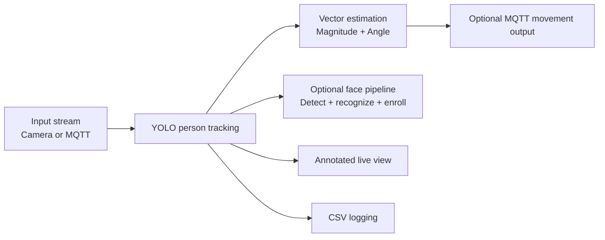

# PSA Prática

Practical project for the Autonomous Systems course (University of Aveiro).

It provides a real-time vision module that detects and tracks people from a camera (or MQTT video stream), estimates movement vectors, and logs detections for later analysis.

## What the project does

- Detects people with YOLOv8 (`yolov8n.pt`)
- Tracks detections frame-by-frame and computes a movement vector
- Draws annotated live video output with IDs and overlays
- Logs detections to CSV (`Timestamp, ID, Confidence, Status`)
- Supports optional face recognition + enrollment workflow
- Can read frames from camera or MQTT and optionally publish vectors via MQTT

## Repository structure

```text
psa-pratica/
├── README.md
└── visao/
    ├── README.md
    ├── main.py
    ├── person_tracker.py
    ├── enroll.py
    ├── data.yaml
    ├── yolov8n.pt
    └── yolov8n-face.pt
```

## Quick start

```bash
cd visao
pip install opencv-python ultralytics torch paho-mqtt pyttsx3
python main.py
```

Press `q` in the video window (or `Ctrl+C` in terminal) to stop.

> If you want face recognition, also install `deepface`.

## End-to-end flow



## How to use this project

- For normal use, run `visao/main.py`.
- For detailed module usage, configuration, and integration examples, see [`visao/README.md`](visao/README.md).
- For enrolling new faces into `visao/known_faces`, run `python visao/enroll.py`.
