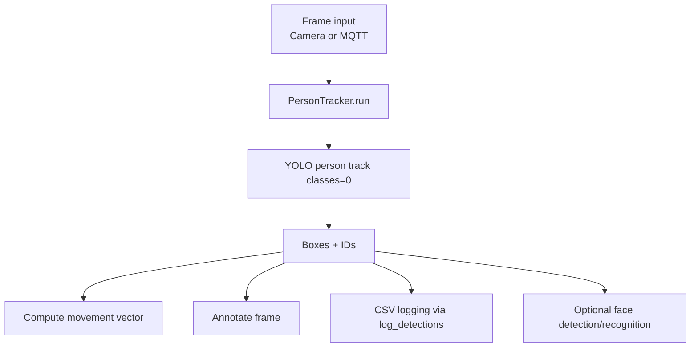

# Visão Module (`visao`)

Real-time people tracking module built with YOLOv8 + OpenCV.

It detects people, tracks IDs, computes movement vectors, shows an annotated video feed, writes CSV logs, and can optionally do face recognition/enrollment.

## Install

From `visao/`:

```bash
pip install opencv-python ultralytics torch paho-mqtt pyttsx3
```

Optional (face recognition matching):

```bash
pip install deepface
```

## Run

From repository root:

```bash
cd visao
python main.py
```

Stop with `q` (video window focused) or `Ctrl+C`.

## Main outputs

- **Live window**: `Tracking View` with person boxes, IDs, vector line, and optional names
- **CSV file**: `surveillance_data.csv` in current working directory
  - Columns: `Timestamp`, `ID`, `Confidence`, `Status`
- **Movement vector** per frame: `[magnitude, angle]`

## Pipeline overview



## Key behavior and configuration

`PersonTracker` constructor (main options):

- `model_path="yolov8n.pt"`
- `face_model_path="yolov8n-face.pt"`
- `conf_threshold=0.3`
- `accept_threshold=None` (defaults to `conf_threshold`)
- `input_source="camera"` (`"mqtt"` also supported)
- `use_mqtt_out=False`
- `mqtt_broker="localhost"`
- `auto_enroll=False`

Notes:
- Non-absolute model paths are resolved relative to `visao/person_tracker.py`.
- If `deepface` is not installed, the module runs with face recognition disabled.

## Enrollment workflow

To add new known faces:

```bash
cd visao
python enroll.py
```

This captures up to 3 face images and stores them in `visao/known_faces/` using a sanitized person name.

## Using as a Python module

Minimal integration pattern:

1. Create a `PersonTracker`
2. Iterate over `tracker.run()`
3. For each frame, consume `(vector, frame, boxes)`
4. If `boxes` exists, call `tracker.log_detections(writer, boxes)`
5. Display or process `frame` and stop on your own condition

For class internals and full behavior, read `person_tracker.py`.
